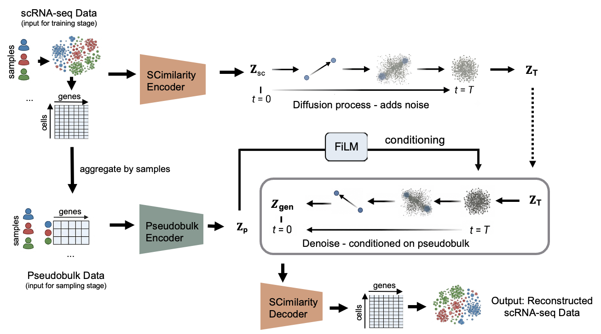

# bulk2scDiff

bulk2scDiff is a latent diffusion model that generates synthetic single-cell RNA-seq populations conditioned on sample-level pseudobulk transcriptomes. By reframing bulk-to-single-cell inference as a conditional generative modeling problem, bulk2scDiff learns distributions of plausible cellular states instead of predicting summary statistics, enabling the generation of coherent single-cell landscapes compatible with the input transcriptomic profile. 

## how it works



A pretrained SCimilarity encoder first projects single cells into a shared latent space. In parallel, cells from each sample are aggregated into a pseudobulk profile and encoded into a conditioning embedding. During training, a forward diffusion process progressively corrupts the cell latents with noise, while a FiLM-conditioned latent U-Net learns to reverse this process using the pseudobulk embedding as guidance. During generation, the model starts from random noise and, given only a pseudobulk profile from either a training or a held-out sample, generates a population of cell latents that are decoded by SCimilarity into synthetic single-cell expression profiles.

## datasets

| dataset | reference | train | held-out | notes |
|----------|-----------|---------:|---------:|-------|
| AML  | [van Galen et al., 2019](https://doi.org/10.1016/j.cell.2019.01.031) | 32 | 9 | MUTZ3 and OCI-AML3 cell-line samples excluded |
| BRCA | [Wu et al., 2021](https://doi.org/10.1038/s41588-021-00911-1) | 21 | 5 | Fixed subtype-balanced split |

- Both models were trained for **1 million diffusion steps**.
- Held-out samples were never used during diffusion model training and were reserved exclusively for evaluating model generalization.

## run

```
bash deploy_aml.sh
bash deploy_brca.sh
```

|  override | effect |
|---|---|
| `DATA_DIR=/path/to/data.h5ad` | override default data path |
| `FORCE_REGENERATE_SAMPLES=1` | overwrite existing `.npz` files |
| `NUM_SAMPLES_OVERRIDE=N` | generate N cells instead of matching real count |


| output | path |
|---|---|
| checkpoints | `output/checkpoint/` |
| logs | `output/logs/` |
| generated samples | `output/simulated_samples/` |

## manual stages

| # | step | script | key flags |
|---|--------|--------|----------|
| 1 | split | `split_aml.py` / `split_brca.py` | `--test_fraction` · `--exclude_sample_ids_path` |
| 2 | VAE | `VAE/VAE_train.py` | `--num_genes` · `--state_dict` · `--include_sample_ids_path` / `--exclude_sample_ids_path` |
| 3 | diffusion | `train.py` | `--vae_path` · `--lr_anneal_steps 1000000` · `--cond_pseudobulk True` · `--cond_embed_dim 128` · `--mmd_eval_interval` |
| 4 | generate | `sample.py` | `--model_path` · `--sample_id` · `--cond_pseudobulk True` · `--cond_embed_dim 128` |

- `--cond_embed_dim` must match between steps 3 and 4. 

- Each generated `.npz` stores: the generated latent cells, the source sample identifier, the conditioning pseudobulk and the real cell count.

## evaluation notebooks

| notebook | covers |
|---|---|
| `{aml,brca}_train_progress.ipynb` | loss, gradients, train-vs-held-out MMD |
| `{aml,brca}_cond_audit.ipynb` | MMD + E-distance heatmap, real vs. generated |
| `{aml,brca}_multi_umap.ipynb` | pooled + per-sample UMAP, gene and latent space |
| `{aml,brca}_global_umap_{train,test}.ipynb` | immune marker-gene overlays, training vs held-out sample splits |


## data format

- input: `.h5ad`, keyed by `SampleID`
- gene filter: detected in ≥3 cells · cell filter: expresses ≥10 genes
- per-cell normalization: fixed library size `1e4` (pre-filter total count) + `log1p`
- pseudobulk: raw counts summed per sample in the retained gene space, then a separate sample-level library-size normalization + `log1p`

Loader: [guided_diffusion/cell_datasets_loader.py](guided_diffusion/cell_datasets_loader.py). Adjust it if your data is preprocessed differently.

## environment

| package | version |
|----|---|
| torch | 1.13.0 |
| numpy | 1.23.4 |
| anndata | 0.8.0 |
| scanpy | 1.9.1 |
| scikit-learn | 1.2.2 |
| scipy | 1.13.1 |
| matplotlib | 3.6.0 |
| blobfile | 2.0.0 |
| pandas | 1.5.1 |
| mpi4py | 3.1.4 |

Full pins in [requirements.txt](requirements.txt). Install `torch` first with the CUDA build matching your system, then `pip install -r requirements.txt`.

## data & license

The AML and BRCA2021 datasets, and the resulting trained checkpoints, are not redistributed in this repository. See the manuscript for data and materials availability.

MIT — see [LICENSE](LICENSE). This project includes code adapted from [scDiffusion](https://github.com/EperLuo/scDiffusion) (MIT License, Copyright (c) 2023 Erpai Luo).
