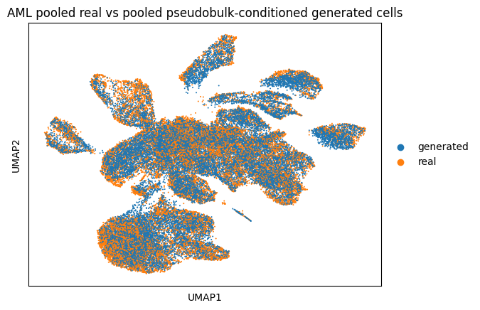
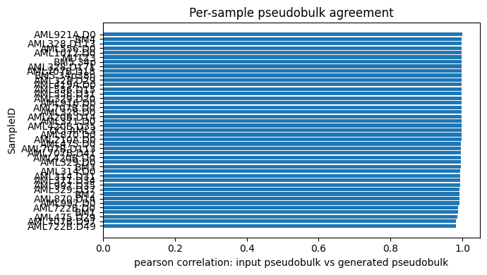
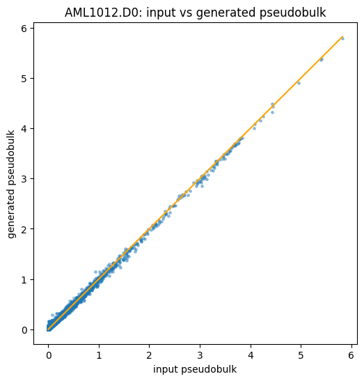
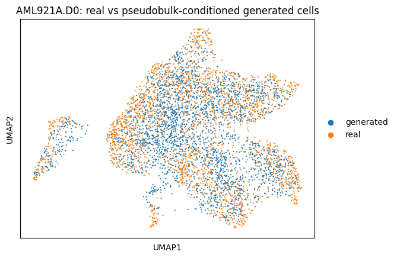

This document explains the **bulk2scDiff** workflow in this repository: a pseudobulk-conditioned latent diffusion model that generates single-cell RNA-seq profiles from a sample-level pseudobulk vector. It is written to match the current code, including the 1,000,000-step ("1M") training runs and the two datasets the project ships with (AML and BRCA2021). This repository ships the single canonical, manuscript-reported configuration for each dataset — not every ablation that was explored during development.

## 1. Conceptual Overview

bulk2scDiff learns a generative map from a sample-level, bulk-like expression summary to the population of single cells compatible with it:

- input condition: one pseudobulk vector representing a biological sample
- output: a population of single-cell latent profiles whose aggregate expression is compatible with that pseudobulk condition

The denoiser is conditioned directly on a continuous pseudobulk summary computed per sample, so the same trained model can be re-conditioned on any sample's pseudobulk (including held-out samples) to synthesize a matched single-cell population.

## 2. Datasets And Sample Splits

The project is currently run on two `.h5ad` datasets, each keyed by `SampleID`:

| Dataset | AnnData file | Retained genes (VAE `num_genes`) | Samples | Split |
|---|---|---|---|---|
| AML (van Galen 2019, NanoWell) | `AML_vanGalen_2019_NanoWell_AnnData.h5ad` | 19616 | 41 (32 train / 9 test) | random 80/20, cell lines removed |
| BRCA2021 (Sunny Wu 2021) | `BreastCancer_SunnyWu_2021_AnnData.h5ad` | 25209 | 26 (21 train / 5 test) | fixed, subtype-balanced |

Split files live under `output/sample_splits/` as `train_samples.txt` / `test_samples.txt` (one `SampleID` per line) plus a `sample_summary.tsv`.

- **AML** splits are produced by [make_aml_sample_splits.py](../make_aml_sample_splits.py). The base split is a random 80/20 sample-level split (`--test_fraction 0.2`, fixed `--seed 1234`) written to `output/sample_splits/aml/` (43 samples). The **canonical run removes the two cell-line samples** (`MUTZ3`, `OCI.AML3`, listed in [aml_excluded_cell_lines.txt](../aml_excluded_cell_lines.txt)) with `--exclude_sample_ids_path`, and inherits the base assignment with `--inherit_split_dir output/sample_splits/aml` so the 9-sample held-out test set is unchanged. The resulting no-cell-line split (32 train / 9 test) is written to `output/sample_splits/aml_nocl/`.
- **BRCA2021** splits are produced by [make_brca2021_subtype_splits.py](../make_brca2021_subtype_splits.py): a *fixed, non-random* 21/5 split into `output/sample_splits/brca2021_manual/`, balanced across cancer subtypes (train: ER+×9, HER2+×4, TNBC×8; test: ER+×2, HER2+×1, TNBC×2). The script validates that the hard-coded assignment exactly covers the dataset and matches the expected subtype counts.

## 3. Data Preprocessing

Preprocessing is implemented in [guided_diffusion/cell_datasets_loader.py](../guided_diffusion/cell_datasets_loader.py), in `read_preprocessed_adata()`. The fixed constants are `MIN_CELLS_PER_GENE = 3`, `MIN_GENES_PER_CELL = 10`, and `NORM_TARGET_SUM = 1e4`.

The exact order is:

1. read the `.h5ad`
2. make gene names unique
3. compute the gene mask from the raw loaded matrix (genes detected in at least `3` cells)
4. compute the cell mask from the raw loaded matrix (cells expressing at least `10` genes)
5. store each retained cell's raw library size *before* gene filtering
6. subset to the retained cells and retained genes
7. normalize each retained cell to total expression `1e4` using that stored pre-gene-filter library size
8. apply `log1p`

"Detected" / "express" means the entry in `adata.X` is nonzero, so this is a simple sparsity / low-complexity filter. It does not use mean expression, total UMI count, mitochondrial fraction, doublet score, or any other QC metric.

Because the gene and cell masks are computed on the raw matrix and the cell-level normalization uses pre-gene-filter library sizes, the retained genes in a cell do not necessarily sum to `1e4` after filtering: the missing mass from filtered-out genes is intentionally preserved in the normalization factor.

When training with `--include_sample_ids_path` or `--exclude_sample_ids_path`, that sample filtering is applied **after** these preprocessing steps (`load_data()` preprocesses the full matrix first, then subsets to the split).

## 4. Pseudobulk Construction

`compute_pseudobulk()` groups cells by `SampleID` and **sums raw counts** across the cells of each sample in the retained gene space. When `normalize_and_log1p=True` (the path used everywhere in this project), each sample-level pseudobulk is then library-size normalized to `1e4` using the sample's aggregated pre-gene-filter library size, and finally `log1p`-transformed.

Because the gene mask is global and the per-sample library size is the sum of pre-gene-filter cell totals, summing `raw_counts[:, gene_mask]` per sample is numerically equivalent on the retained genes to:

1. aggregate the original raw single-cell matrix per sample
2. subset the aggregated sample vectors to the retained genes
3. normalize each sample vector by its full pre-gene-filter library size
4. apply `log1p`

So the conditioning vector is **not** a mean of already-normalized single-cell profiles. It is a separately normalized sample-level pseudobulk built from raw counts.

Timing during diffusion data loading (`load_data` with `include_pseudobulk=True`):

1. `read_preprocessed_adata()` returns the normalized/`log1p` matrix, the aligned raw-count matrix, and the pre-gene-filter per-cell library sizes
2. optional sample include/exclude filtering is applied to all three
3. the preprocessed cells are encoded with the VAE into latent vectors (the diffusion model's training inputs)
4. `compute_pseudobulk(raw_counts, sample_values, sample_library_sums=..., normalize_and_log1p=True)` builds one pseudobulk per sample
5. the dataset stores latent cell vectors as inputs and attaches each cell's source-sample pseudobulk in `out_dict["pseudobulk"]`

The pseudobulk is computed once from raw counts during data loading; it is not recomputed from VAE latents and is not used during VAE training. Every diffusion-training cell is paired with the pseudobulk of its source sample.

## 5. VAE / Latent Representation

The latent space is provided by the repository's VAE module ([VAE/VAE_model.py](../VAE/VAE_model.py)), trained by [VAE/VAE_train.py](../VAE/VAE_train.py):

- a 128-dimensional latent (the encoder L2-normalizes its output, so latents lie on a unit hypersphere)
- encoder/decoder hidden widths `[1024, 1024, 1024]`
- trained with mean-squared-error reconstruction loss (it is an autoencoder; there is no KL / variational sampling term despite the `VAE` name)
- the decoder applies a final `ReLU` when producing gene-space reconstructions
- initialized from pretrained SCimilarity encoder/decoder weights (`--state_dict /share/models/SCimilarity/annotation_model_v1`)

Each deployment fine-tunes the VAE for `200000` steps (`--max_steps 200000`). The two canonical drivers deliberately differ in **which samples the VAE sees**:

- **AML** (`output/checkpoint/AE/my_VAE_nocl`): fit on all 41 non-cell-line samples (32 train + 9 held-out test).
- **BRCA2021** (`output/checkpoint/AE/brca2021_VAE_alltrain`): fit on **all 26 samples, including the 5 held-out test samples**. A pilot ablation found that including the test samples in VAE training improves test-cell reconstruction fidelity substantially (mean per-gene Pearson r: 0.166 → 0.253, +52% relative), so the manuscript's BRCA2021 VAE is trained this way.

In both datasets, **held-out status is enforced only at the diffusion-training stage** (`--include_sample_ids_path train_samples.txt`), never at the VAE stage — so the VAE always sees every sample's cells, but the diffusion backbone never trains on the held-out test samples. The diffusion model trains and generates entirely in this 128-dim latent space; the VAE decoder is only used for inspection/evaluation.

## 6. Model Conditioning

The denoiser is `Cell_Unet` in [guided_diffusion/cell_model.py](../guided_diffusion/cell_model.py). When `cond_pseudobulk=True` it builds a `PseudobulkEncoder`:

- `LayerNorm(input_dim)`
- `Linear(input_dim -> pseudobulk_hidden_dim)` · `SiLU`
- `LayerNorm(pseudobulk_hidden_dim)`
- `Linear(pseudobulk_hidden_dim -> pseudobulk_hidden_dim)` · `SiLU`
- `LayerNorm(pseudobulk_hidden_dim)`
- `Linear(pseudobulk_hidden_dim -> cond_embed_dim)`

The deployed configuration (as passed by the deployment scripts) is:

- `pseudobulk_dim` = retained gene count, inferred from the VAE checkpoint (19616 for AML, 25209 for BRCA2021)
- `pseudobulk_hidden_dim = 512` (code default)
- `cond_embed_dim = 128` (every deployment passes `--cond_embed_dim 128`; the code default is `256`, so always pass the same value at sampling time)

The encoded condition is injected into the denoiser in two ways:

1. **Time path:** `cond_to_time` projects the condition to the time-embedding width and adds it to the timestep embedding.
2. **FiLM modulation:** each `ResidualBlock` produces `(gamma, beta)` from the condition and applies `h * (1 + gamma) + beta`.

The denoiser itself is a latent MLP U-Net: `input_dim=128` (the latent), hidden widths `[512, 512, 256, 128]`, residual blocks on the way down, and skip-additions on the way back up.

## 7. Diffusion Objective

Standard DDPM-style latent diffusion (`guided_diffusion/script_util.py`, `gaussian_diffusion.py`):

- latent input from the trained VAE
- linear beta schedule, `1000` diffusion steps
- epsilon (noise) prediction with fixed (non-learned) variance
- MSE denoising objective

Per training step: take a clean latent cell, sample Gaussian noise, run the forward (noising) process, feed the noised latent + timestep + sample pseudobulk to the denoiser, predict the noise, and minimize MSE against the true noise.

## 8. Training And The 1M Workflow

Diffusion training is driven by [cell_train.py](../cell_train.py) (`TrainLoop`): `lr=1e-4`, `weight_decay=1e-4`, `batch_size=128`, `ema_rate=0.9999`, `save_interval=200000`, `lr_anneal_steps=1000000` (the LR anneals linearly to zero over that budget). With `save_interval=200000`, checkpoints land at steps `0, 200K, 400K, 600K, 800K, 1M`:

- checkpoints: `output/checkpoint/backbone/<model_name>/model{step}.pt` (plus `ema_*` and `opt_*`)
- logs: `output/logs/<model_name>/` (`progress.csv`, `mmd_eval_history.csv`, `log.txt`)
- generated samples: `output/simulated_samples/<model_name>_{train,test}_<SampleID>.npz`

where `<model_name>` is `aml_pseudobulk_1M_nocl` (AML) or `brca2021_pseudobulk_1M_alltrain` (BRCA2021).

**In-training MMD evaluation.** Both deployments enable periodic held-out evaluation via `PeriodicPseudobulkMMDEvaluator` ([guided_diffusion/pseudobulk_mmd_eval.py](../guided_diffusion/pseudobulk_mmd_eval.py)) with `--mmd_eval_interval 10000`, `--mmd_eval_max_cells 1200`, and `--mmd_eval_validation_sample_ids_path <test_samples.txt>`. Every 10,000 steps it:

- precomputes, for each `SampleID`, the sample pseudobulk and the VAE-encoded real cells (capped at 1200 cells per sample)
- splits samples into `train` (included/trained samples) and `validation` (the held-out test samples)
- generates latents for each sample under its pseudobulk and computes an unbiased RBF-kernel MMD vs the real latents, averaged over three median-heuristic bandwidths
- writes per-sample rows to `mmd_eval_history.csv` and summary metrics (`mmd_train_mean`, `mmd_validation_mean`, `mmd_validation_minus_train_mean`, …) into `progress.csv`

This makes the held-out test MMD a signal you can watch *during* training, not just after sampling.

### 8.1 End-to-end deployment scripts

Each dataset has one canonical, idempotent (skips steps whose outputs already exist) end-to-end driver, both at 1,000,000 diffusion steps:

- [aml_pseudobulk_1M_nocl_deployment.sh](../aml_pseudobulk_1M_nocl_deployment.sh) — AML, **cell lines removed**. Stage 0 builds `output/sample_splits/aml_nocl/` (excluding the two cell-line samples and inheriting the base 80/20 split assignment via `--inherit_split_dir`), stage 1 fine-tunes the VAE into `output/checkpoint/AE/my_VAE_nocl` with `--exclude_sample_ids_path` (so it still sees the held-out test samples, just not the cell lines), and stages 2–3 train and sample the `aml_pseudobulk_1M_nocl` model.
- [brca2021_pseudobulk_1M_alltrain_deployment.sh](../brca2021_pseudobulk_1M_alltrain_deployment.sh) — BRCA2021, **VAE trained on all 26 samples**. Stage 0 writes the fixed subtype-balanced split, stage 1 fine-tunes the VAE into `output/checkpoint/AE/brca2021_VAE_alltrain` with no sample filtering at all (all 26 samples), and stages 2–3 train and sample the `brca2021_pseudobulk_1M_alltrain` model, restricting diffusion training to the 21 training samples via `--include_sample_ids_path`.

Both drivers run the same four stages: (0) write the train/test split files, (1) fine-tune the VAE, (2) train the pseudobulk-conditioned diffusion backbone on the training samples only (`--include_sample_ids_path train_samples.txt`) with periodic MMD eval against the test split, and (3) generate one `.npz` per sample for both the train and test splits, matching each sample's real cell count by default. Stage 3 uses `resolve_highest_step_checkpoint` to pick the final checkpoint (`model1000000.pt`). Env overrides: `FORCE_REGENERATE_SAMPLES=1` and `NUM_SAMPLES_OVERRIDE=N`.

## 9. Sampling

Sample-conditioned generation is handled by [pseudobulk_sample.py](../pseudobulk_sample.py). Given a chosen `SampleID`, it:

1. loads and preprocesses the dataset
2. recomputes that sample's pseudobulk from raw counts with the same sample-level normalization + `log1p`
3. runs reverse diffusion in latent space under that condition (ancestral `p_sample_loop`; DDIM optional)
4. saves the generated latent population plus metadata

The saved `.npz` contains:

- `cell_gen`: generated latent cells
- `source_sample_id`: the sample used as condition
- `input_pseudobulk`: the exact pseudobulk vector used for generation
- `real_num_cells`: number of real cells in the source sample (the default generation count)
- `pseudobulk_reduction`: always `sum`

## 10. Evaluation Notebooks

All evaluation lives in [notebooks/](../notebooks/), shipped with their executed outputs so the results are visible without rerunning (a few BRCA2021 notebooks were executed headlessly via [notebooks/nbrun.py](../notebooks/nbrun.py); for those, the rendered figures sit in a sibling `<notebook_stem>_figs/` folder instead of being embedded inline). The notebooks come in dataset- and split-specific variants; structurally-identical variants differ only in the data path, split file, generated-`.npz` glob, and titles. All notebooks here read the **1M** canonical generated outputs and the shared VAE checkpoint. They fall into four groups.

### 10.1 Training-progress diagnostics

`script_pseudobulk_training_progress_aml_1M.ipynb`, `..._brca2021_1M.ipynb`

Visualize one training run by reading `progress.csv`, `mmd_eval_history.csv`, and `log.txt` from the corresponding `output/logs/<model_name>` directory. Sections:

1. **Run summary + checkpoint recommendation** — headline metrics and a rule that flags whether the best held-out test MMD agrees with the best train loss or peaked earlier (suggesting an earlier checkpoint for best generalization).
2. **Generalization quality (MMD)** — periodic train vs held-out test MMD over training, the `test − train` gap (rising gap = distributional overfitting), and per-sample MMD trajectories with the median and worst-final sample highlighted.
3. **Optimization diagnostics** — loss (= MSE), gradient norm, and parameter norm; a tail zoom over the last 20% of training; and loss decomposed by diffusion-timestep quartile.
4. **Raw training log** — the tail of `log.txt`.

These tell you whether optimization is healthy and whether held-out generation improved; low loss alone is explicitly not treated as sufficient.

### 10.2 Held-out conditioning audit (primary quantitative check)

`script_pseudobulk_conditioning_audit_aml.ipynb`, `script_pseudobulk_conditioning_audit_brca2021.ipynb`

The recommended after-the-fact evaluation. For every generated `.npz` (1M outputs), the notebook looks up the matching real cells, encodes them into the shared VAE latent space, and compares the real vs generated latent clouds with RBF-kernel MMD (a distribution-vs-distribution comparison; no 1:1 cell matching). For each sample it reports:

- `latent_mmd_rbf` — the main per-sample score (lower is better)
- `real_vs_real_mmd_rbf` — a same-sample baseline (the real sample split into two random halves)
- `real_vs_other_sample_mmd_rbf` — a mismatched baseline using the nearest wrong real sample in latent-centroid space

A good generated sample sits closer to its same-sample baseline than to the nearest-other-sample baseline. Outputs: a sortable per-sample table tagged `train`/`test`, a bar plot that separates the two splits and overlays both baselines, and a joint real-vs-generated latent UMAP for one focus sample (AML defaults to `BM4`, BRCA2021 to `CID3941`).

### 10.3 Qualitative UMAP overlays

**`script_pseudobulk_conditioned_multi_sample_umap_aml.ipynb`** and **`..._brca2021.ipynb`** — dataset-level notebooks that pool *all* available generated samples. They provide:

- a global pooled real-vs-generated UMAP (Seurat-HVG gene space), colored by source and by `SampleID`
- a per-sample proxy-pseudobulk agreement table and bar plot (Pearson/Spearman between the stored conditioning pseudobulk and the decoded generated proxy)
- per-sample real-vs-generated overlays rendered three ways: (1) a joint gene-space HVG UMAP, (2) an `sc.tl.ingest` projection of generated cells onto a real-only reference embedding, and (3) a joint **VAE-latent-space** UMAP (encoder(real) vs diffusion(generated)) — the most direct diagnostic, since latent overlap there but not in gene space would implicate the decoder rather than the diffusion model

Both notebooks read the `_1M` outputs (`aml_pseudobulk_1M_nocl_*.npz` and `brca2021_pseudobulk_1M_*.npz`).

### 10.4 Marker-gene biological audit

`script_aml_marker_gene_audit_{train,test}.ipynb`, `script_brca2021_marker_gene_audit_{train,test}.ipynb`

These check whether the VAE + 1M diffusion model preserves cell-type / subtype marker biology in decoded generated cells, against the matched real cells of one split. The `train`/`test` pair for each dataset is identical except for the split file and generated glob. Each notebook decodes generated latents to the full gene space and runs six sections:

1. **Joint Seurat-HVG UMAP** — real + generated embedded together (source-mixing diagnostic), real cells colored by author cell type, generated cells colored by `SampleID`.
2. **Author cell-type UMAP** — the same joint embedding colored by cell-type labels, to confirm biological structure is preserved.
3. **Per-gene expression overlays** — each marker (and negative control) as a `log1p` color overlay, real vs generated, with a shared per-gene scale capped at the real 99th percentile.
4. **Expression-distribution boxplots** — per marker: real target-class vs real other vs generated (negative controls: real vs generated).
5. **Marker-positive cell fraction** — bars of the fraction of cells expressing each marker above a `0.5` `log1p` threshold, real vs generated.
6. **Global gene-mean correlation** — per-gene mean `log1p` across all cells, real vs generated, with Pearson/Spearman and a `y = x` reference, marker genes highlighted.

Marker panels differ by dataset: **AML** uses three immune panels (T cell, B cell, Monocyte/Macrophage) plus `ACTB`/`HPRT1` controls, mapping the `CellType` labels to immune classes; **BRCA2021** adds cancer-subtype panels (ER+, HER2+, TNBC) alongside immune panels and the controls, and splits boxplots by `subtype`.

### 10.5 Conditioning-specificity swap audit (cross-sample control)

[run_conditioning_swap.py](../notebooks/run_conditioning_swap.py) — command-line script (not a notebook). For every real sample it compares matched generation (`MMD(real_i, gen_i)`, generated from that sample's own pseudobulk) against mismatched generation (`MMD(real_i, gen_j)`, `j != i`, generated from every *other* sample's pseudobulk). If conditioning is actually driving generation, the matched score should be the lowest in each row (headline metric: top-1 correct-match rate). Supports `mmd` and `edist` (energy distance) metrics via `--metric`. [make_swap_figures.py](../notebooks/make_swap_figures.py) / [make_swap_figures_notitle.py](../notebooks/make_swap_figures_notitle.py) render the resulting cross-sample matrices as heatmaps (BRCA2021 + AML side by side). [compute_pseudobulk_corr.py](../notebooks/compute_pseudobulk_corr.py) recovers the companion per-sample pseudobulk-agreement correlation for the BRCA2021 all-train run using the same decoded-proxy methodology as §10.3.

## 11. Qualitative Figures (AML examples)

These illustrative AML figures are kept from earlier runs of the qualitative notebooks. They show what the pipeline produces but are not the primary evidence — the held-out latent-space MMD audit (§10.2) is.

### 11.1 Global AML real vs generated view

*Figure 1. Global pooled UMAP from `script_pseudobulk_conditioned_multi_sample_umap_aml.ipynb`: generated cells pooled across all sample-specific pseudobulk conditions vs the pooled real AML cells.*

### 11.2 Per-sample pseudobulk agreement

*Figure 2. Per-sample agreement from `script_pseudobulk_conditioned_multi_sample_umap_aml.ipynb`: Pearson correlation between the conditioning pseudobulk and the decoded generated proxy pseudobulk for each sample.*

### 11.3 One-sample pseudobulk agreement example

*Figure 3. Example pseudobulk scatter for `AML1012.D0`: stored conditioning pseudobulk vs the proxy aggregated from decoded generated cells. Illustrative figure from an earlier single-sample run; the shipped [script_pseudobulk_conditioned_multi_sample_umap_aml.ipynb](../notebooks/script_pseudobulk_conditioned_multi_sample_umap_aml.ipynb) reproduces this per-sample agreement check for every sample at once.*

### 11.4 One-sample real vs generated UMAP

*Figure 4. Sample-matched gene-space UMAP for `AML921A.D0`: real and pseudobulk-conditioned generated cells in one embedding. Illustrative figure from an earlier single-sample run; see the shipped multi-sample notebook (§10.3) for the equivalent per-sample overlays.*

## 12. How To Read These Figures

- The global UMAP is qualitative: it shows whether generated cells occupy a plausible region of expression space, not whether each sample is reconstructed correctly.
- The per-sample pseudobulk agreement is a decoded-cell-space heuristic. Because the training condition is a raw-count aggregation followed by sample-level normalization, the notebooks compare against a decoded proxy pseudobulk (`log1p(mean(expm1(cells)))`) rather than re-applying the training-time `sum` to decoded values.
- The single-sample scatter is a useful sanity check but not an exact like-for-like comparison to the training-time pseudobulk definition.
- The sample-matched and latent-space UMAPs are useful for spotting overlap, separation, and possible mode collapse; latent overlap without gene-space overlap points at the decoder, not the diffusion model.

## 13. Important Implementation Notes And Caveats

What the implementation does deliberately:

- cell-level normalization uses pre-gene-filter library sizes
- the pseudobulk condition is built from raw counts, then normalized and `log1p`-transformed per sample
- every training cell is conditioned on its source-sample pseudobulk
- the exact conditioning vector used at generation time is saved with the output
- training, sampling, and held-out MMD evaluation all recompute the pseudobulk the same way

Caveats:

- The conditioning pseudobulk is built in the retained gene space; this does not change retained-gene values relative to aggregating the full raw matrix first (because pre-gene-filter sample library sizes are kept).
- Sample include/exclude filtering happens after preprocessing, so a split is applied to an already normalized and logged matrix.
- The `cond_embed_dim` used at sampling must match training (`128` here); the code default is `256`.
- The AML and BRCA2021 VAEs are trained on different sample populations by design (AML: all non-cell-line samples; BRCA2021: literally all samples, including held-out test) — see §5. Held-out evaluation validity rests on the diffusion backbone, not the VAE, never having trained on the test samples.
- For strong claims, prefer held-out-sample evaluation with distribution-level metrics (latent-space MMD) over pseudobulk agreement alone.

## 14. Relevant Files

- [aml_pseudobulk_1M_nocl_deployment.sh](../aml_pseudobulk_1M_nocl_deployment.sh): canonical AML driver (1M steps, cell lines removed)
- [aml_excluded_cell_lines.txt](../aml_excluded_cell_lines.txt): cell-line `SampleID`s deleted from the canonical AML run
- [brca2021_pseudobulk_1M_alltrain_deployment.sh](../brca2021_pseudobulk_1M_alltrain_deployment.sh): canonical BRCA2021 driver (1M steps, VAE trained on all 26 samples)
- [make_aml_sample_splits.py](../make_aml_sample_splits.py) / [make_brca2021_subtype_splits.py](../make_brca2021_subtype_splits.py): sample-split generators
- [guided_diffusion/cell_datasets_loader.py](../guided_diffusion/cell_datasets_loader.py): preprocessing, pseudobulk construction, dataset assembly, VAE encode/decode helpers
- [guided_diffusion/cell_model.py](../guided_diffusion/cell_model.py): pseudobulk encoder, FiLM residual blocks, latent denoiser
- [guided_diffusion/pseudobulk_mmd_eval.py](../guided_diffusion/pseudobulk_mmd_eval.py): in-training periodic latent-space MMD evaluation
- [VAE/VAE_train.py](../VAE/VAE_train.py) / [VAE/VAE_model.py](../VAE/VAE_model.py): latent autoencoder training and architecture
- [cell_train.py](../cell_train.py): diffusion training entry point
- [pseudobulk_sample.py](../pseudobulk_sample.py): sample-conditioned latent generation
- [notebooks/](../notebooks/): the evaluation notebooks and scripts described in §10

## 15. Recommended Validation Flow

1. Create the sample-level train/test split (random for AML, fixed subtype-balanced for BRCA2021).
2. Fine-tune the VAE — on all non-cell-line samples for AML, on all samples (including held-out test) for BRCA2021.
3. Train the pseudobulk-conditioned diffusion model on the training samples only, with periodic held-out MMD evaluation enabled.
4. Review the run with the matching `script_pseudobulk_training_progress_*_1M` notebook to confirm stable optimization and inspect the train vs held-out test MMD trend before trusting samples.
5. Generate synthetic populations for both splits (the deployment scripts do this for every sample).
6. Run the `script_pseudobulk_conditioning_audit_*` notebook and/or `run_conditioning_swap.py` as the primary held-out evaluation (per-sample latent MMD/E-distance vs same-sample and mismatched-sample baselines).
7. Use the marker-gene audit and UMAP notebooks as supporting biological and qualitative checks.

## 16. Summary

bulk2scDiff is a pseudobulk-conditioned latent diffusion model for single-cell RNA-seq generation, combining VAE-based latent representation learning, sample-level pseudobulk construction, a continuous pseudobulk encoder, and FiLM-conditioned latent diffusion. It ships one canonical, manuscript-reported 1,000,000-step configuration per dataset (AML: cell lines removed; BRCA2021: VAE trained on all samples including held-out test), periodic in-training held-out MMD evaluation, and a notebook suite covering training diagnostics, held-out distribution audits (latent MMD and the cross-sample conditioning-swap control), qualitative UMAP overlays, and marker-gene biology. For rigorous claims, the main comparison is distributional agreement between real and generated cells on held-out samples (latent-space MMD / E-distance and the conditioning-swap top-1 match rate), with pseudobulk agreement as a secondary conditioning sanity check.
